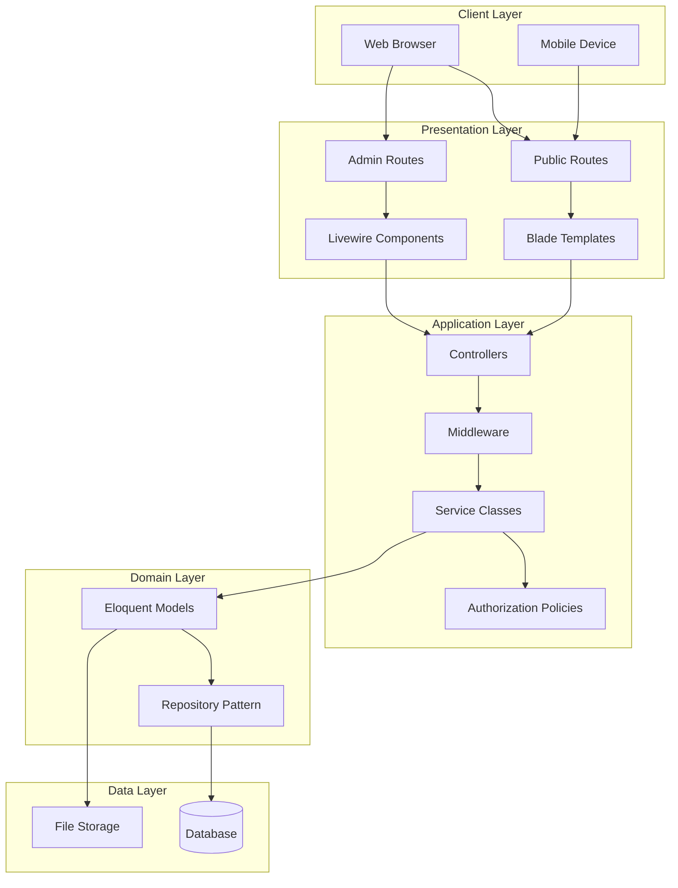
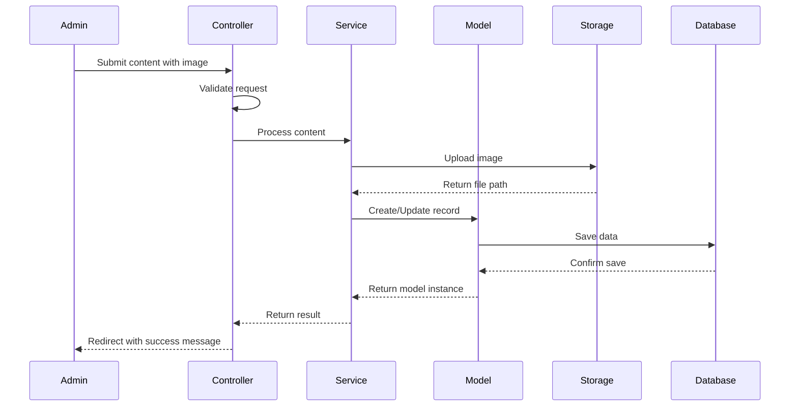
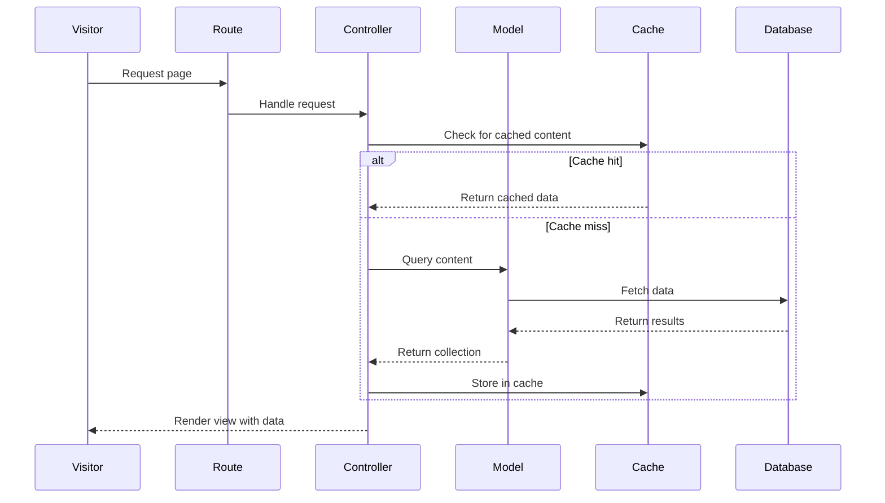

# Design Document

## Overview

The portfolio website for Hon. Fatimatu Abubakar is a Laravel 12-based web application featuring a public-facing front-end and an authenticated admin backend. The system leverages Laravel Livewire/Volt for reactive components, Tailwind CSS v4 for styling, and Vite for asset compilation. The design emphasizes visual impact, professional presentation, and ease of content management while maintaining performance and accessibility standards.

The architecture follows Laravel's MVC pattern with additional Livewire components for interactive features. Content is stored in a MySQL/SQLite database with images managed through Laravel's filesystem abstraction. The design draws inspiration from the Obama Foundation website, featuring full-width hero sections, card-based layouts, and sophisticated typography.

## Architecture

### System Architecture



### Technology Stack

- **Backend Framework**: Laravel 12.x
- **Frontend Framework**: Livewire Volt 1.7 + Livewire Flux 2.1
- **Styling**: Tailwind CSS v4
- **Build Tool**: Vite 7.x
- **Database**: MySQL 8.0+ or SQLite (development)
- **Authentication**: Laravel Fortify 1.30
- **Testing**: Pest 4.x
- **Image Processing**: Intervention Image (to be added)
- **Rich Text Editor**: Trix Editor (to be added)

### Directory Structure

```
app/
├── Http/
│   ├── Controllers/
│   │   ├── Admin/
│   │   │   ├── DashboardController.php
│   │   │   ├── GalleryController.php
│   │   │   ├── NewsController.php
│   │   │   ├── PageController.php
│   │   │   └── ContactSubmissionController.php
│   │   └── PublicController.php
│   └── Middleware/
│       └── AdminMiddleware.php
├── Models/
│   ├── GalleryItem.php
│   ├── NewsArticle.php
│   ├── Page.php
│   ├── ContactSubmission.php
│   └── Initiative.php
├── Services/
│   ├── ImageService.php
│   ├── NewsService.php
│   └── PageService.php
└── Policies/
    ├── GalleryItemPolicy.php
    └── NewsArticlePolicy.php

resources/
├── views/
│   ├── public/
│   │   ├── home.blade.php
│   │   ├── about.blade.php
│   │   ├── initiatives.blade.php
│   │   ├── gallery.blade.php
│   │   ├── news/
│   │   │   ├── index.blade.php
│   │   │   └── show.blade.php
│   │   └── contact.blade.php
│   ├── admin/
│   │   ├── dashboard.blade.php
│   │   ├── gallery/
│   │   ├── news/
│   │   ├── pages/
│   │   └── contacts/
│   ├── components/
│   │   ├── hero-banner.blade.php
│   │   ├── initiative-card.blade.php
│   │   ├── news-card.blade.php
│   │   └── gallery-grid.blade.php
│   └── layouts/
│       ├── public.blade.php
│       └── admin.blade.php
├── css/
│   └── app.css
└── js/
    └── app.js

database/
├── migrations/
│   ├── xxxx_create_gallery_items_table.php
│   ├── xxxx_create_news_articles_table.php
│   ├── xxxx_create_pages_table.php
│   ├── xxxx_create_contact_submissions_table.php
│   └── xxxx_create_initiatives_table.php
└── seeders/
    ├── AdminUserSeeder.php
    └── DefaultPagesSeeder.php
```

## Components and Interfaces

### Database Schema

#### users table
```sql
- id: bigint (PK)
- name: varchar(255)
- email: varchar(255) UNIQUE
- email_verified_at: timestamp NULL
- password: varchar(255)
- two_factor_secret: text NULL
- two_factor_recovery_codes: text NULL
- remember_token: varchar(100) NULL
- created_at: timestamp
- updated_at: timestamp
```

#### gallery_items table
```sql
- id: bigint (PK)
- title: varchar(255)
- caption: text NULL
- category: enum('events', 'community', 'official_duties')
- image_path: varchar(500)
- sort_order: int DEFAULT 0
- is_published: boolean DEFAULT true
- created_at: timestamp
- updated_at: timestamp
```

#### news_articles table
```sql
- id: bigint (PK)
- title: varchar(255)
- slug: varchar(255) UNIQUE
- excerpt: text
- content: longtext
- featured_image_path: varchar(500) NULL
- author_id: bigint (FK -> users.id)
- status: enum('draft', 'published') DEFAULT 'draft'
- published_at: timestamp NULL
- meta_title: varchar(255) NULL
- meta_description: text NULL
- created_at: timestamp
- updated_at: timestamp
```

#### pages table
```sql
- id: bigint (PK)
- slug: varchar(255) UNIQUE
- title: varchar(255)
- content: longtext
- meta_title: varchar(255) NULL
- meta_description: text NULL
- updated_by: bigint (FK -> users.id)
- created_at: timestamp
- updated_at: timestamp
```

#### page_revisions table
```sql
- id: bigint (PK)
- page_id: bigint (FK -> pages.id)
- content: longtext
- updated_by: bigint (FK -> users.id)
- created_at: timestamp
```

#### initiatives table
```sql
- id: bigint (PK)
- title: varchar(255)
- slug: varchar(255) UNIQUE
- short_description: text
- full_description: longtext
- featured_image_path: varchar(500) NULL
- impact_stats: json NULL
- sort_order: int DEFAULT 0
- is_published: boolean DEFAULT true
- created_at: timestamp
- updated_at: timestamp
```

#### contact_submissions table
```sql
- id: bigint (PK)
- name: varchar(255)
- email: varchar(255)
- subject: varchar(255)
- message: text
- is_read: boolean DEFAULT false
- ip_address: varchar(45) NULL
- user_agent: text NULL
- created_at: timestamp
- updated_at: timestamp
```

### Eloquent Models

#### GalleryItem Model
```php
class GalleryItem extends Model
{
    protected $fillable = [
        'title', 'caption', 'category', 'image_path', 
        'sort_order', 'is_published'
    ];
    
    protected $casts = [
        'is_published' => 'boolean',
        'sort_order' => 'integer',
    ];
    
    // Scopes
    public function scopePublished($query)
    public function scopeByCategory($query, $category)
    public function scopeOrdered($query)
    
    // Accessors
    public function getImageUrlAttribute()
    
    // Methods
    public function deleteWithImage()
}
```

#### NewsArticle Model
```php
class NewsArticle extends Model
{
    protected $fillable = [
        'title', 'slug', 'excerpt', 'content', 
        'featured_image_path', 'author_id', 'status', 
        'published_at', 'meta_title', 'meta_description'
    ];
    
    protected $casts = [
        'published_at' => 'datetime',
    ];
    
    // Relationships
    public function author()
    
    // Scopes
    public function scopePublished($query)
    public function scopeRecent($query)
    
    // Accessors
    public function getFeaturedImageUrlAttribute()
    public function getReadingTimeAttribute()
    
    // Methods
    public function publish()
    public function unpublish()
}
```

#### Page Model
```php
class Page extends Model
{
    protected $fillable = [
        'slug', 'title', 'content', 
        'meta_title', 'meta_description', 'updated_by'
    ];
    
    // Relationships
    public function revisions()
    public function updatedBy()
    
    // Methods
    public function saveRevision()
}
```

#### Initiative Model
```php
class Initiative extends Model
{
    protected $fillable = [
        'title', 'slug', 'short_description', 'full_description',
        'featured_image_path', 'impact_stats', 'sort_order', 'is_published'
    ];
    
    protected $casts = [
        'impact_stats' => 'array',
        'is_published' => 'boolean',
        'sort_order' => 'integer',
    ];
    
    // Scopes
    public function scopePublished($query)
    public function scopeOrdered($query)
    
    // Accessors
    public function getFeaturedImageUrlAttribute()
}
```

#### ContactSubmission Model
```php
class ContactSubmission extends Model
{
    protected $fillable = [
        'name', 'email', 'subject', 'message',
        'is_read', 'ip_address', 'user_agent'
    ];
    
    protected $casts = [
        'is_read' => 'boolean',
    ];
    
    // Scopes
    public function scopeUnread($query)
    public function scopeRecent($query)
    
    // Methods
    public function markAsRead()
}
```

### Service Classes

#### ImageService
```php
class ImageService
{
    public function upload(UploadedFile $file, string $directory): string
    public function delete(string $path): bool
    public function resize(string $path, int $width, int $height): string
    public function generateThumbnail(string $path): string
}
```

#### NewsService
```php
class NewsService
{
    public function createArticle(array $data): NewsArticle
    public function updateArticle(NewsArticle $article, array $data): NewsArticle
    public function deleteArticle(NewsArticle $article): bool
    public function publishArticle(NewsArticle $article): NewsArticle
}
```

#### PageService
```php
class PageService
{
    public function updatePage(Page $page, array $data, User $user): Page
    public function getRevisionHistory(Page $page, int $limit = 10): Collection
    public function restoreRevision(PageRevision $revision): Page
}
```

### Controllers

#### Admin Controllers

**DashboardController**
- `index()`: Display admin dashboard with statistics

**GalleryController**
- `index()`: List all gallery items
- `create()`: Show upload form
- `store(Request $request)`: Handle image upload
- `edit(GalleryItem $item)`: Show edit form
- `update(Request $request, GalleryItem $item)`: Update gallery item
- `destroy(GalleryItem $item)`: Delete gallery item

**NewsController**
- `index()`: List all articles
- `create()`: Show article creation form
- `store(Request $request)`: Create new article
- `edit(NewsArticle $article)`: Show edit form
- `update(Request $request, NewsArticle $article)`: Update article
- `destroy(NewsArticle $article)`: Delete article
- `publish(NewsArticle $article)`: Publish article

**PageController**
- `index()`: List editable pages
- `edit(Page $page)`: Show page editor
- `update(Request $request, Page $page)`: Update page content
- `revisions(Page $page)`: Show revision history

**ContactSubmissionController**
- `index()`: List all submissions
- `show(ContactSubmission $submission)`: View submission details
- `markAsRead(ContactSubmission $submission)`: Mark as read
- `destroy(ContactSubmission $submission)`: Delete submission

#### Public Controllers

**PublicController**
- `home()`: Display homepage
- `about()`: Display about page
- `initiatives()`: Display initiatives listing
- `initiativeDetail(Initiative $initiative)`: Display single initiative
- `gallery()`: Display gallery
- `news()`: Display news listing
- `newsDetail(NewsArticle $article)`: Display single article
- `contact()`: Display contact form
- `submitContact(Request $request)`: Handle contact form submission

### Livewire Components

#### Admin Components

**Admin/GalleryManager**
- Properties: `$items`, `$category`, `$search`
- Methods: `filterByCategory()`, `deleteItem()`
- Real-time filtering and deletion

**Admin/NewsEditor**
- Properties: `$article`, `$title`, `$content`, `$status`
- Methods: `save()`, `publish()`, `uploadFeaturedImage()`
- Rich text editing with Trix

**Admin/ContactInbox**
- Properties: `$submissions`, `$filter`
- Methods: `markAsRead()`, `filterSubmissions()`
- Real-time inbox management

#### Public Components

**ContactForm**
- Properties: `$name`, `$email`, `$subject`, `$message`
- Methods: `submit()`, `resetForm()`
- Validation: Required fields, email format
- Real-time validation feedback

**NewsletterSubscription**
- Properties: `$email`
- Methods: `subscribe()`
- Email validation and submission

**GalleryFilter**
- Properties: `$category`, `$items`
- Methods: `filterByCategory()`
- Dynamic gallery filtering without page reload

### Blade Components

**hero-banner.blade.php**
```php
@props([
    'image',
    'title',
    'subtitle' => null,
    'height' => 'h-screen'
])
```

**initiative-card.blade.php**
```php
@props([
    'initiative',
    'showStats' => true
])
```

**news-card.blade.php**
```php
@props([
    'article',
    'featured' => false
])
```

**gallery-grid.blade.php**
```php
@props([
    'items',
    'columns' => 3
])
```

## Data Models

### Data Flow Diagrams

#### Content Management Flow


#### Public Content Retrieval Flow


### Image Storage Strategy

**Storage Structure:**
```
storage/app/public/
├── gallery/
│   ├── original/
│   └── thumbnails/
├── news/
│   └── featured/
├── initiatives/
│   └── featured/
└── pages/
    └── content/
```

**Image Processing Pipeline:**
1. Upload validation (type, size, dimensions)
2. Generate unique filename with timestamp
3. Store original in appropriate directory
4. Generate optimized versions (thumbnail, medium, large)
5. Store file path in database
6. Return public URL for display

### Caching Strategy

**Cache Keys:**
- `pages:{slug}`: Page content (TTL: 1 hour)
- `news:published`: Published articles list (TTL: 15 minutes)
- `gallery:{category}`: Gallery items by category (TTL: 30 minutes)
- `initiatives:published`: Published initiatives (TTL: 1 hour)
- `contact:unread_count`: Unread submissions count (TTL: 5 minutes)

**Cache Invalidation:**
- Clear relevant cache on content update/delete
- Use cache tags for grouped invalidation
- Implement cache warming for critical pages

## Error Handling

### Validation Rules

**Gallery Upload:**
```php
[
    'image' => 'required|image|mimes:jpeg,png,jpg,webp|max:5120',
    'title' => 'required|string|max:255',
    'caption' => 'nullable|string|max:1000',
    'category' => 'required|in:events,community,official_duties',
]
```

**News Article:**
```php
[
    'title' => 'required|string|max:255',
    'slug' => 'required|string|max:255|unique:news_articles,slug,' . $id,
    'excerpt' => 'required|string|max:500',
    'content' => 'required|string',
    'featured_image' => 'nullable|image|mimes:jpeg,png,jpg,webp|max:5120',
    'status' => 'required|in:draft,published',
    'published_at' => 'nullable|date',
]
```

**Contact Form:**
```php
[
    'name' => 'required|string|max:255',
    'email' => 'required|email|max:255',
    'subject' => 'required|string|max:255',
    'message' => 'required|string|max:5000',
]
```

### Error Pages

**404 Not Found**
- Custom design matching site aesthetic
- Helpful navigation links
- Search functionality
- Recent news articles

**500 Server Error**
- Generic error message (production)
- Detailed stack trace (development)
- Contact information
- Automatic error logging

**403 Forbidden**
- Clear explanation of access restriction
- Login link for admin areas
- Return to homepage link

### Exception Handling

**Custom Exceptions:**
```php
ImageUploadException
ArticlePublishException
PageUpdateException
```

**Global Exception Handler:**
- Log all exceptions to `storage/logs/laravel.log`
- Send critical errors to admin email
- Return JSON for API requests
- Render custom error pages for web requests

### Logging Strategy

**Log Channels:**
- `daily`: General application logs (7 days retention)
- `admin`: Admin actions audit trail (30 days retention)
- `security`: Authentication and authorization events (90 days retention)

**Logged Events:**
- User login/logout
- Content creation/update/deletion
- Failed authentication attempts
- Image upload failures
- Contact form submissions
- Cache clearing operations

## Testing Strategy

### Unit Tests

**Model Tests:**
- Test model relationships
- Test scopes and query builders
- Test accessors and mutators
- Test model methods

**Service Tests:**
- Test ImageService upload/delete/resize
- Test NewsService CRUD operations
- Test PageService revision management
- Mock external dependencies

### Feature Tests

**Public Routes:**
- Test homepage displays correctly
- Test about page content rendering
- Test initiatives listing and detail pages
- Test gallery filtering functionality
- Test news listing and article pages
- Test contact form submission and validation

**Admin Routes:**
- Test authentication requirement
- Test gallery CRUD operations
- Test news article management
- Test page editing and revisions
- Test contact submission viewing

**Livewire Component Tests:**
- Test ContactForm validation and submission
- Test GalleryFilter category filtering
- Test Admin components interactions

### Browser Tests (Optional)

**Critical User Flows:**
- Complete contact form submission flow
- Admin login and content creation flow
- Gallery image upload and categorization
- News article creation and publishing

### Performance Tests

**Metrics to Monitor:**
- Page load time < 2 seconds
- Time to First Byte (TTFB) < 500ms
- Largest Contentful Paint (LCP) < 2.5s
- First Input Delay (FID) < 100ms
- Cumulative Layout Shift (CLS) < 0.1

**Load Testing:**
- Test concurrent user handling (100+ users)
- Test image upload under load
- Test database query performance
- Test cache effectiveness

### Accessibility Testing

**WCAG 2.1 Level AA Compliance:**
- Keyboard navigation support
- Screen reader compatibility
- Color contrast ratios (4.5:1 minimum)
- Alt text for all images
- Semantic HTML structure
- ARIA labels where appropriate

## Design System

### Color Palette

```css
:root {
    --color-primary-blue: #003366;
    --color-accent-gold: #D4A017;
    --color-secondary-blue: #007AB8;
    --color-white: #FFFFFF;
    --color-off-white: #F8F8F8;
    --color-dark-grey: #444444;
    --color-light-grey: #E5E5E5;
    --color-success: #10B981;
    --color-error: #EF4444;
    --color-warning: #F59E0B;
}
```

### Typography

**Font Families:**
```css
--font-heading: 'Playfair Display', serif;
--font-body: 'Poppins', sans-serif;
```

**Font Sizes (Tailwind Custom Config):**
```javascript
fontSize: {
    'display': ['4.5rem', { lineHeight: '1.1', letterSpacing: '-0.02em' }],
    'h1': ['3rem', { lineHeight: '1.2', letterSpacing: '-0.01em' }],
    'h2': ['2.25rem', { lineHeight: '1.3' }],
    'h3': ['1.875rem', { lineHeight: '1.4' }],
    'h4': ['1.5rem', { lineHeight: '1.5' }],
    'body-lg': ['1.125rem', { lineHeight: '1.75' }],
    'body': ['1rem', { lineHeight: '1.75' }],
    'body-sm': ['0.875rem', { lineHeight: '1.6' }],
}
```

### Spacing System

**Custom Spacing (Tailwind):**
```javascript
spacing: {
    'section': '5rem',      // 80px
    'section-sm': '3rem',   // 48px
    'card': '1.5rem',       // 24px
    'element': '1rem',      // 16px
}
```

### Component Patterns

**Hero Banner:**
- Full viewport height on desktop
- 60vh on mobile
- Overlay gradient for text readability
- Centered content with max-width constraint

**Card Components:**
- White background with subtle shadow
- Hover effect: lift + shadow increase
- Image aspect ratio 16:9 or 4:3
- Consistent padding and spacing

**Buttons:**
- Primary: Gold background, white text
- Secondary: Blue outline, blue text
- Hover: Darken by 10%
- Padding: py-3 px-6
- Border radius: rounded-lg

**Forms:**
- Input height: 48px minimum
- Label above input
- Error messages below input in red
- Success messages in green
- Focus state: blue ring

### Responsive Breakpoints

```javascript
screens: {
    'sm': '640px',
    'md': '768px',
    'lg': '1024px',
    'xl': '1280px',
    '2xl': '1536px',
}
```

**Layout Behavior:**
- Mobile: Single column, stacked content
- Tablet: 2-column grid for cards
- Desktop: 3-column grid, side-by-side sections
- Large desktop: Max-width container (1280px)

### Animation & Transitions

**Scroll Animations:**
```javascript
// Fade in on scroll
IntersectionObserver for elements with .fade-in class
Opacity: 0 → 1
Transform: translateY(20px) → translateY(0)
Duration: 600ms
Easing: ease-out
```

**Hover Transitions:**
```css
transition: all 0.3s ease;
```

**Page Transitions:**
- Minimal, fast transitions between pages
- Loading indicator for async operations

## SEO Implementation

### Meta Tags Structure

**Homepage:**
```html
<title>Hon. Fatimatu Abubakar | Leadership & Legacy</title>
<meta name="description" content="Official website of Hon. Fatimatu Abubakar...">
<meta property="og:title" content="Hon. Fatimatu Abubakar">
<meta property="og:description" content="...">
<meta property="og:image" content="[hero-image-url]">
<meta property="og:type" content="website">
<meta name="twitter:card" content="summary_large_image">
```

**News Articles:**
```html
<title>[Article Title] | Hon. Fatimatu Abubakar</title>
<meta name="description" content="[Article Excerpt]">
<meta property="og:type" content="article">
<meta property="article:published_time" content="[ISO Date]">
<meta property="article:author" content="Hon. Fatimatu Abubakar">
```

### Sitemap Generation

**Dynamic Sitemap (routes/web.php):**
```php
Route::get('/sitemap.xml', function() {
    $pages = ['/', '/about', '/initiatives', '/gallery', '/news', '/contact'];
    $articles = NewsArticle::published()->get();
    $initiatives = Initiative::published()->get();
    
    return response()->view('sitemap', compact('pages', 'articles', 'initiatives'))
        ->header('Content-Type', 'text/xml');
});
```

### Structured Data

**Organization Schema:**
```json
{
    "@context": "https://schema.org",
    "@type": "Person",
    "name": "Hon. Fatimatu Abubakar",
    "jobTitle": "Minister",
    "url": "[website-url]",
    "sameAs": [
        "[facebook-url]",
        "[twitter-url]",
        "[linkedin-url]"
    ]
}
```

**Article Schema:**
```json
{
    "@context": "https://schema.org",
    "@type": "Article",
    "headline": "[Article Title]",
    "image": "[Featured Image URL]",
    "datePublished": "[ISO Date]",
    "author": {
        "@type": "Person",
        "name": "Hon. Fatimatu Abubakar"
    }
}
```

## Security Considerations

### Authentication & Authorization

- Laravel Fortify for authentication
- Admin middleware for protected routes
- CSRF protection on all forms
- Rate limiting on contact form (5 submissions per hour per IP)
- Password requirements: minimum 8 characters, mixed case, numbers

### File Upload Security

- Whitelist allowed MIME types
- Maximum file size: 5MB
- Store uploads outside public directory
- Generate unique filenames
- Validate image dimensions
- Scan for malicious content

### Input Sanitization

- HTML purification for rich text content
- XSS protection via Blade escaping
- SQL injection prevention via Eloquent ORM
- Validation on all user inputs

### HTTPS & Headers

- Force HTTPS in production
- Security headers:
  - X-Frame-Options: SAMEORIGIN
  - X-Content-Type-Options: nosniff
  - X-XSS-Protection: 1; mode=block
  - Strict-Transport-Security: max-age=31536000

## Deployment Configuration

### Environment Variables

```env
APP_NAME="Hon. Fatimatu Abubakar"
APP_ENV=production
APP_DEBUG=false
APP_URL=https://fatimatuabubakar.com

DB_CONNECTION=mysql
DB_HOST=127.0.0.1
DB_PORT=3306
DB_DATABASE=portfolio_db
DB_USERNAME=portfolio_user
DB_PASSWORD=[secure-password]

MAIL_MAILER=smtp
MAIL_HOST=smtp.mailtrap.io
MAIL_PORT=2525
MAIL_USERNAME=[username]
MAIL_PASSWORD=[password]
MAIL_FROM_ADDRESS=noreply@fatimatuabubakar.com
MAIL_FROM_NAME="${APP_NAME}"

FILESYSTEM_DISK=public
```

### Server Requirements

- PHP 8.2+
- MySQL 8.0+ or MariaDB 10.3+
- Nginx or Apache with mod_rewrite
- Composer 2.x
- Node.js 18+ and NPM
- SSL certificate

### Deployment Steps

1. Clone repository
2. Run `composer install --optimize-autoloader --no-dev`
3. Run `npm install && npm run build`
4. Copy `.env.example` to `.env` and configure
5. Run `php artisan key:generate`
6. Run `php artisan storage:link`
7. Run `php artisan migrate --force`
8. Run `php artisan db:seed --class=AdminUserSeeder`
9. Run `php artisan db:seed --class=DefaultPagesSeeder`
10. Set proper permissions on `storage` and `bootstrap/cache`
11. Configure web server to point to `public` directory
12. Set up SSL certificate
13. Configure cron for scheduled tasks: `* * * * * php artisan schedule:run`

### Performance Optimization

- Enable OPcache in production
- Use Redis for cache and sessions
- Implement CDN for static assets
- Enable Gzip compression
- Optimize images before upload
- Implement lazy loading for images
- Minify CSS and JavaScript
- Use HTTP/2

### Backup Strategy

- Daily database backups (retained 30 days)
- Weekly full backups including uploads (retained 90 days)
- Automated backup to cloud storage (S3, DigitalOcean Spaces)
- Test restore procedure monthly

## Future Enhancements

### Phase 2 Features (Post-MVP)

- Multi-language support (English, French)
- Event calendar with RSVP functionality
- Video gallery with YouTube/Vimeo integration
- Advanced search functionality
- Newsletter management system
- Social media feed integration
- Analytics dashboard for admin
- PDF generation for reports/documents
- Comment system for news articles (moderated)
- Mobile app (PWA)

### Scalability Considerations

- Database read replicas for high traffic
- Queue system for email notifications
- CDN integration for global reach
- Horizontal scaling with load balancer
- Microservices architecture for specific features
